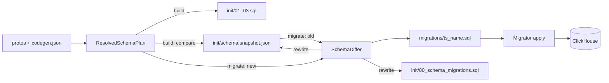

# План: миграции ClickHouse-схемы в kafka2ch

Добавить в `ClickHouseSchemaGen` поддержку эволюции схемы без потери данных: committed-снапшот разрешённого плана как источник «старого» состояния, differ по номерам proto-полей, генерация идемпотентных SQL-миграций, проверка снапшота на build, C#-раннер с таблицей версий и one-shot сервис в compose. Параллельно — сохранение Kafka-метанформации (message key, headers) в MergeTree через виртуальные колонки engine.

## Договорённости

- Никто не правит схему ClickHouse вручную; живая база == `init SQL релиза + применённые миграции`.
- Источник «старого» состояния — только committed `schema.snapshot.json` (разрешённый план после expansion автоколонок). Режим diff по двум `.pb` не делаем.
- `dotnet build` снапшот не двигает, а сверяет и падает при расхождении; снапшот двигает только `migrate`.
- Идентичность колонки — путь из номеров proto-полей (`FieldNumberPath`), не имя: rename => `RENAME COLUMN`.
- Автоматика делает только доказуемо безопасное (`ADD`, `RENAME` при том же типе, расширяющий `MODIFY`); деструктивное и ручное — закомментированный шаблон + флаг.
- Kafka-таблицы и MV пересоздаются (постоянных данных не содержат); MergeTree — только `ALTER`.
- Перед recreate Kafka-таблицы раннер/SQL **гарантирует flush** буфера в MergeTree (см. ниже); иначе возможен commit offset без записи в целевую таблицу.
- Эволюция proto — только **BACKWARD-compatible** (новая схема умеет читать старые payload’ы в топике). Несовместимое изменение — отказ `migrate`, не «умный» SQL. Schema Registry на парсинг CH не влияет (`skip_bytes = 6`).
- В MergeTree сохраняются Kafka **message key** и **headers** (виртуальные колонки engine → колонки целевой таблицы через MV). Опционально — `_topic` / `_partition` / `_offset` / `_timestamp(_ms)` тем же механизмом.
- `trailingSql` непрозрачен: только warning «изменился», миграция агрегатов — вручную в том же файле.
- Таблица версий `schema_migrations` с checksum, строгий линейный порядок, без `Down()`, применение — отдельный one-shot сервис, не старт `sandbox-app`.

## Kafka meta: message key и headers

Kafka engine парсит только **value**. Ключ и заголовки доступны как [виртуальные колонки](https://clickhouse.com/docs/reference/engines/table-engines/integrations/kafka) при `SELECT` из queue; в `CREATE TABLE … ENGINE = Kafka` их объявлять не нужно — в DDL queue их нет. Чтобы не потерять meta после flush в MergeTree, MV должна явно прочитать их в **обычные** колонки целевой таблицы.

| Виртуальная колонка | Тип в CH | Колонка в MergeTree (канон) | Примечание |
|---|---|---|---|
| `_key` | `String` | `kafka_key String` | Сырые байты ключа. У нас ключ — protobuf (`OrderKey`); CH его не десериализует. Декод — на стороне приложения при необходимости (`ParseFrom`). |
| `_headers.name` + `_headers.value` | `Array(String)` × 2 | `kafka_headers Map(String, String)` | В MV: `mapFromArrays(\`_headers.name\`, \`_headers.value\`) AS kafka_headers`. Пустые headers → `map()`. |
| `_topic` (opt.) | `LowCardinality(String)` | `kafka_topic` | Полезно при multi-topic queue; у нас один topic на таблицу — по умолчанию выкл. |
| `_partition` / `_offset` (opt.) | `UInt64` | `kafka_partition` / `kafka_offset` | Для идемпотентности / дедупа; по умолчанию выкл. |
| `_timestamp` / `_timestamp_ms` (opt.) | `Nullable(DateTime)` / `Nullable(DateTime64(3))` | `kafka_timestamp` | Broker timestamp; по умолчанию выкл. |

Конфиг (`clickhouse.codegen.json`), секция на таблицу или в `defaults`:

```json
"persistKafkaMeta": {
  "key": true,
  "headers": true,
  "topic": false,
  "partition": false,
  "offset": false,
  "timestampMs": false
}
```

Поведение генератора:

- `KafkaMetaColumnFactory` добавляет в план **не** колонки queue DDL, а `PipelineColumnMapping` + колонки MergeTree с `FieldNumberPath` вида `kafka:_key`, `kafka:_headers` (не пересекаются с proto-номерами; differ join’ит по ним же).
- **Auto** MergeTree (`columns: []` + `sourceTable`): meta-колонки дописываются к зеркалу queue автоматически, если `persistKafkaMeta` включён.
- **Explicit** MergeTree: meta нужно либо перечислить в `columns` + `materializedViews[].columns`, либо включить флаг `includeKafkaMeta: true` на таблице / view (генератор дописывает канонические колонки и mapping). Без флага и без явных колонок meta не попадает в explicit-пайплайн (текущий `orders` — обновить конфиг: добавить `kafka_key`, `kafka_headers` и mapping).
- `MaterializedViewAutoGenerator` / expander учитывают meta при построении SELECT.
- Имена целевых колонок фиксированы каноном выше (переименование через явный `target` в mapping, если понадобится).

Миграции при первом включении meta на уже существующей таблице:

1. `ALTER TABLE orders ADD COLUMN IF NOT EXISTS kafka_key String DEFAULT ''`, `ADD COLUMN IF NOT EXISTS kafka_headers Map(String, String) DEFAULT map()` (после `DETACH` queue).
2. Recreate MV с новым SELECT (старые строки в MergeTree останутся с default; новые сообщения заполнят meta).
3. Queue DDL не меняется (виртуальные колонки не в CREATE) — recreate queue только если параллельно менялась proto-схема / kafka settings.

Differ: появление `kafka:_key` / `kafka:_headers` в плане = `ColumnAdded` + `ViewChanged`, не proto-compat issue. Отключение meta = `ColumnRemoved` → Destructive (или оставить колонки в таблице, убрать только из MV — тогда warning «orphan columns»).

Пример фрагмента MV:

```sql
CREATE MATERIALIZED VIEW orders_mv TO orders AS
SELECT
    order_id AS order_id,
    -- … payload …
    _key AS kafka_key,
    mapFromArrays(`_headers.name`, `_headers.value`) AS kafka_headers
FROM orders_queue;
```

## Гарантия flush: Kafka queue → MergeTree перед recreate

Kafka engine не хранит строки: буфер в памяти + consumer group offsets в Kafka. `DROP TABLE orders_queue` без остановки может потерять незакоммиченный батч (или, в старых версиях, закоммитить offset без записи в MV). Гарантия — официальный stop-consumption из [доков ClickHouse](https://clickhouse.com/docs/integrations/connectors/data-ingestion/kafka/kafka-table-engine): сначала `DETACH` queue.

Правильный порядок при recreate queue / MV:

```sql
-- 1. Остановить poll. DETACH дожидается flush текущего блока в зависимые MV и commit offset.
DETACH TABLE IF EXISTS orders_queue;

-- 2. (раннер) дождаться, что consumers для таблицы исчезли:
--    SELECT count() FROM system.kafka_consumers
--    WHERE database = currentDatabase() AND table = 'orders_queue';
--    должно стать 0 (с таймаутом и ошибкой при истечении).

-- 3. Только после этого — ALTER MergeTree (поток остановлен, рассинхрона MV↔таблица нет).
ALTER TABLE orders ADD COLUMN IF NOT EXISTS ...;

-- 4. Пересоздать MV и queue (queue уже detached — DROP безопасен).
DROP VIEW IF EXISTS orders_mv;
DROP TABLE IF EXISTS orders_queue;
CREATE TABLE orders_queue (...);
CREATE MATERIALIZED VIEW orders_mv TO orders AS SELECT ... FROM orders_queue;
```

Инварианты:

- Тот же `kafka_group_name` → после `CREATE` чтение продолжается с последнего закоммиченного offset; уже попавшие в MergeTree строки не читаются повторно. (Смена `groupName` — отдельный warning: offsets теряются.)
- `DETACH TABLE <queue>` — обязательный statement в миграции **до** любого `DROP` queue; генерируется `MigrationSqlGenerator`, не оставляется на усмотрение оператора.
- Раннер дополнительно поллит `system.kafka_consumers` после `DETACH` (не полагаемся только на то, что `DETACH` вернул OK). Таймаут — конфиг Migrator (например 60s).
- Опционально для prod: перед apply остановить публикацию (`sandbox-app` / producers) на окно миграции — уменьшает at-least-once на границе; для sandbox не обязательно, если `DETACH`+wait соблюдены.
- Не делать `DETACH` только MV «чтобы остановить поток»: при `MV TO` именно view тянет данные из Kafka; отрыв MV без `DETACH` queue оставляет неочевидное состояние. Каноническая остановка — `DETACH` queue.

## Смешанный топик: старые и новые protobuf-сообщения

ClickHouse с `kafka_schema_registry_skip_bytes = 6` **не** выбирает схему по schema id из Confluent-конверта: конверт отбрасывается, payload парсится одним локальным файлом из `format_schemas` (`ProtobufSingle`). После выкладки нового `.proto` и recreate `*_queue` **и старые, и новые** сообщения читаются новой схемой.

Следствие: миграция на месте безопасна только если новая схема — backward-compatible reader для всего, что ещё может прийти из топика (непрочитанный хвост + весь retention при replay / смене `groupName`).

| Изменение proto | Старое сообщение после миграции |
|---|---|
| Добавили поле (новый номер) | колонка = protobuf default (`0` / `''` / `NULL` для optional) |
| Rename при том же номере | значение на месте (wire — номер, не имя) |
| Новое значение enum | в старых сообщениях его нет; старые значения — валидное подмножество |
| Удалили поле, номер в `reserved` | байты в payload игнорируются |

Уже лежащие в MergeTree строки закрываются `ALTER … ADD COLUMN … DEFAULT`. MV после recreate должна переживать дефолты старых сообщений (`ifNull` / прямое копирование; без CAST/делений, падающих на пустом значении).

`ProtoCompatibilityValidator` **блокирует** `migrate` (миграция не генерируется), если:

- переиспользован `FieldNumberPath` с другим wire-/scalar-типом;
- сменён scalar kind (`int32` → `string` и т.п.);
- удалено enum-значение (может ещё прийти из топика);
- несовместимо перестроены `oneof` / nested / map;
- нарушен инвариант «один top-level message в файле» (ломает `skip_bytes = 6` / message-index `0x00`).

Schema Registry (`AutoRegisterSchemas`, BACKWARD/FULL) полезен для producer’ов и других консьюмеров, но **не защищает** ClickHouse — дисциплина для CH = правила protobuf + этот validator.

Выкладка атомарна относительно парсинга: новый `format_schemas` (bind-mount) должен оказаться на диске **до** `CREATE` новой queue в apply. В compose это один деплой: обновлённый volume + `clickhouse-migrate`. Иначе окно, где queue ещё со старой схемой, а producer уже шлёт v2 (или наоборот).

Несовместимое изменение — вне автоматики: новый топик + новый `groupName` + cutover, либо дождаться истечения retention топика. В плане sandbox такие сценарии не автоматизируем; validator отказывает с явной ошибкой.

## Поток данных



## Состав файлов после внедрения

| Каталог / файл | Кто пишет | Как меняется |
|---|---|---|
| `docker/clickhouse/init/01..03_*.sql` | `dotnet build` | перезаписываются целиком, всегда конечная схема |
| `docker/clickhouse/init/00_schema_migrations.sql` | `migrate` | один файл, перезаписывается; +1 строка `INSERT` на миграцию |
| `docker/clickhouse/init/schema.snapshot.json` | `migrate` | один файл, перезаписывается |
| `docker/clickhouse/migrations/<ts>_<name>.sql` | `migrate` | +1 файл на каждое изменение схемы |

## Этап 1. Разрешённый план, `FieldNumberPath` и Kafka meta

Цель: единая промежуточная модель, из которой рендерится и init SQL, и снапшот.

- `tools/ClickHouseSchemaGen/Models/ClickHouseColumn.cs`: добавить `public string FieldNumberPath { get; init; } = "";` (например `"3.2"` для `price.amount`, `"oneof:payment"` для presence-колонки, `"kafka:_key"` / `"kafka:_headers"` для meta).
  - Заполнять в `ScalarFieldStrategy`, `RepeatedFieldStrategy`, `MapFieldStrategy`, `FieldMappingHelpers.TryCreateFromTypeOverride`, `MessageFieldStrategy` (WKT/Tuple — номер поля; `FlattenNestedColumns` — префикс `{Field.FieldNumber}.{nested}`), `DenormalizationPlanner.MapOneof` / `TryCreateJsonFallbackColumns`. Номер всегда есть в `FieldMappingRequest.Field`.
  - В `ClickHouseColumn.Create` добавить параметр `fieldNumberPath` (optional, чтобы не ломать существующие тесты).
- `tools/ClickHouseSchemaGen/Models/CodegenConfig.cs`:
  - `PersistKafkaMetaConfig` (`key`, `headers`, опционально `topic` / `partition` / `offset` / `timestampMs`) в `defaults` и override на `kafkaTables[]` / `mergeTreeTables[]` (`includeKafkaMeta`).
  - `PipelineColumnConfig` получает `string? FieldNumberPath`.
- `KafkaMetaColumnFactory`: канонические колонки + mapping (`_key` → `kafka_key`, `mapFromArrays(\`_headers.name\`, \`_headers.value\`)` → `kafka_headers`). Не добавляет поля в DDL Kafka-таблицы.
- `PipelineColumnExpander` / `MaterializedViewAutoGenerator`: для auto-зеркала и `includeKafkaMeta` дописывают meta в MergeTree + MV; `PipelineColumnExpander.ExpandMergeTreeTable` переносит `FieldNumberPath` из queue/meta.
- Новый `tools/ClickHouseSchemaGen/Planning/ResolvedSchemaPlan.cs` (records): `KafkaTablePlan` (config + proto-columns), `MergeTreeTablePlan` (expanded config + `Origin: Explicit|Auto`), `MaterializedViewPlan` (expanded config + `Origin`), `TrailingSql`.
- `ClickHouseSchemaGenerator`: вынести из `GenerateFromConfigFile` / `BuildPipelineSql` чистый `ResolvedSchemaPlan BuildPlan(CodegenConfig config)`; рендер init SQL — `SchemaPlanRenderer.RenderInitScripts(plan)` поверх существующих генераторов.
- Рефакторинг `BuildPlan` без включения meta — байт-в-байт `01..02_*.sql` не меняются. Включение `persistKafkaMeta` в `clickhouse.codegen.json` для `orders` — **осознанный** diff `02_pipeline.sql` (+ колонки и mapping); оформляется baseline-миграцией или сразу в init при `migrate init` на пустом стенде.
- Загрузку конфига вынести в `CodegenConfigLoader.Load(path)` (переиспользуется CLI, Tasks, тестами).

## Этап 2. Снапшот

- Новый `tools/ClickHouseSchemaGen/Snapshot/SchemaSnapshot.cs` + `SchemaSnapshotSerializer` (System.Text.Json, детерминированный порядок, `"version": 1`). Содержит всё, что нужно для рендера старого DDL без git: kafka-таблицы (columns c `fieldNumberPath`, `protoFile`, `messageName`, kafka-settings, `persistKafkaMeta`), MergeTree (`origin`, `sourceTable`, `orderBy`, `ttl`, columns с `fieldNumberPath` включая `kafka:*`), MV (`origin`, маппинги с `expression` в т.ч. `mapFromArrays` для headers), `trailingSqlHash`, `parent` (checksum предыдущего снапшота — для детекта разошедшихся веток).
- `SchemaSnapshot.FromPlan(plan)` и `SchemaSnapshot.ToPlan()` (обратное преобразование для рендера старого DDL в тестах и для differ'а).
- Путь по умолчанию: `docker/clickhouse/init/schema.snapshot.json`. Новая корневая секция `migrations` в `clickhouse.codegen.json`: `{ "snapshotPath", "migrationsDirectory", "versionsOutputPath" }`, все поля с дефолтами.
- Снапшот отсутствует: `migrate init` создаёт baseline-снапшот без миграции; build при отсутствии снапшота — warning, не ошибка (первый прогон).

## Этап 3. Проверка на build

- `ClickHouseSchemaGenerator.GenerateFromConfigFile`: после записи init SQL — `SnapshotDriftChecker.Check(plan, snapshot)`; при расхождении бросать `SchemaDriftException` с человекочитаемым списком отличий и подсказкой `ClickHouseSchemaGen.Cli migrate --config ... --name <name>`.
- `tools/ClickHouseSchemaGen.Tasks/ClickHouseSchemaGen.Tasks.csproj`: пробрасывать свойство `SkipClickHouseSnapshotCheck` в задачу (новый параметр `CheckSnapshot`); `src/Sandbox.Contracts/Sandbox.Contracts.csproj` — передавать `SkipClickHouseSnapshotCheck`. `Dockerfile` уже строит с `SkipClickHouseCodegen=true`, не затрагивается.

## Этап 4. Differ и классификация типов

- `tools/ClickHouseSchemaGen/Migration/SchemaDiffer.cs`: `SchemaDiff Diff(ResolvedSchemaPlan old, ResolvedSchemaPlan @new)`.
  - Join колонок по `FieldNumberPath` (fallback по имени, если path пуст).
  - Записи: `TableAdded`, `TableRemoved`, `ColumnAdded(after)`, `ColumnRenamed`, `ColumnTypeChanged(kind)`, `ColumnRemoved`, `KafkaTableChanged` (любой diff колонок/настроек => пересоздание; смена `groupName` => warning об offsets), `ViewChanged`, `TrailingSqlChanged`, `OrderByOrTtlChanged`, `OriginChanged`.
- `tools/ClickHouseSchemaGen/Migration/TypeCompatibility.cs`: строковый классификатор `Safe | Rewrite | Destructive | Manual` для случаев: `T -> Nullable(T)`, расширение значений `Enum8` / `Enum8 -> Enum16`, `String <-> LowCardinality(String)`, расширение целых, `Float32 -> Float64`, `DateTime -> DateTime64`; всё внутри `Nested/Tuple/Map/Array` и сужения — `Manual`.
- `tools/ClickHouseSchemaGen/Migration/MigrationPolicy.cs`: правила понижения: `OriginChanged` или изменение колонки из `ORDER BY` => вся таблица `Manual`; `ColumnRemoved` => `Destructive`; `Added` / `Renamed` / Safe `Modify` => автоматика.
- `ProtoCompatibilityValidator` (gate перед differ/SQL): сравнить old/new **proto**-колонки по `FieldNumberPath` (игнорировать префикс `kafka:`) и отказать в `migrate`, если нарушена BACKWARD-совместимость смешанного топика (см. раздел выше): переиспользование номера с другим типом, смена scalar kind, удаление enum-значения, ломающий oneof/nested/map, смена единственного top-level message. Ошибка — список нарушений, SQL не пишется.
- Включение / выключение `persistKafkaMeta` — обычный schema diff (`ColumnAdded` / `ColumnRemoved` + `ViewChanged`), не proto-compat.

## Этап 5. Генерация SQL миграции

- `tools/ClickHouseSchemaGen/Migration/MigrationSqlGenerator.cs`, порядок в файле (см. «Гарантия flush»):
  1. Заголовок: generated-header, имя, дата, `parent` / `target` checksums, warnings (`trailingSql` изменился, `groupName` изменился).
  2. Для каждой пересоздаваемой Kafka-таблицы: `DETACH TABLE IF EXISTS <queue>;` + маркер-комментарий `-- await:kafka_consumers_empty <queue>` (раннер исполняет wait; чистый SQL без раннера — оператор ждёт сам).
  3. MergeTree: `ALTER TABLE t ADD COLUMN IF NOT EXISTS c T DEFAULT <d> AFTER prev`, `RENAME COLUMN IF EXISTS a TO b`, `MODIFY COLUMN c T` (только Safe / Rewrite). Дефолты по типу: `Nullable` — без default, `String` / `LowCardinality(String)` — `''`, числа — `0`, `Array` / `Map` — `[]` / `map()`, `Enum` — первое значение, `DateTime*` — `toDateTime(0)`. Для meta: `kafka_key` → `DEFAULT ''`, `kafka_headers` → `DEFAULT map()`.
  4. Новые MergeTree-таблицы — полный `CREATE TABLE IF NOT EXISTS` из `MergeTreeTableGenerator` (с комментарием про backfill через новую `kafka_group_name`).
  5. Для изменённых queue/MV: `DROP VIEW IF EXISTS <mv>;` → при изменении proto/settings queue: `DROP TABLE IF EXISTS <queue>;` → `CREATE TABLE <queue> ...` → `CREATE MATERIALIZED VIEW <mv> ...` (с `_key` / `mapFromArrays` при включённом meta). Если менялась только meta / mapping MV без proto — queue можно не трогать: достаточно `DROP VIEW` + `CREATE MATERIALIZED VIEW` после `ALTER` MergeTree (queue остаётся `DETACH`→`ATTACH`, либо `DETACH` снят recreate’ом MV при всё ещё существующей таблице — предпочтительно `ATTACH TABLE <queue>` после recreate MV, если queue не дропали). SELECT MV обязан быть устойчив к protobuf-default’ам старых сообщений.
  6. Блок `-- MANUAL` / `-- DESTRUCTIVE`: закомментированные `DROP COLUMN`, шаблоны `ADD + ALTER UPDATE + DROP` для split / несовместимых типов, изменения `ORDER BY` / `TTL`, `trailingSql`.
- Файл: `docker/clickhouse/migrations/{yyyyMMddHHmmss}_{name}.sql`. Если есть `Manual` / `Destructive` и не передан `--allow-manual`, файл пишется, но снапшот и `00_*.sql` не обновляются, exit code 2 с сообщением.
- `MergeTreeTableGenerator` / `KafkaTableGenerator`: добавить параметр `ifNotExists` (или отдельный метод), чтобы не менять init-вывод.

## Этап 6. Таблица версий и раннер

- `tools/ClickHouseSchemaGen/Migration/SchemaMigrationsScriptGenerator.cs`: `docker/clickhouse/init/00_schema_migrations.sql` — `CREATE TABLE IF NOT EXISTS schema_migrations (version String, name String, checksum String, applied_at DateTime) ENGINE = MergeTree ORDER BY version;` + `INSERT` всех версий из каталога миграций (checksum = SHA-256 файла). Перезаписывается на каждом `migrate`.
- Новый проект `tools/ClickHouseSchemaGen.Migrator/` (Exe, `UseAppHost=false`, ссылки: `ClickHouseSchemaGen`, `ClickHouse.Client` 7.14.0 — уже используется в App и тестах). Отдельный проект, чтобы `ClickHouseSchemaGen` оставался без зависимости на драйвер и MSBuild shadow-copy не тянула лишнее.
  - `MigrationRunner.ApplyAsync(connection, migrationsDir, ct)`: создать `schema_migrations`; прочитать применённые; сверить checksum уже применённых файлов (расхождение — ошибка); проверить отсутствие pending старше последней применённой (out-of-order — ошибка); применить pending по порядку, statement за statement (сплит по `;` вне строк / комментариев); записать строку версии только после успеха файла. Повторный прогон после сбоя безопасен благодаря `IF [NOT] EXISTS`.
  - После statement `DETACH TABLE <queue>` (и по маркеру `-- await:kafka_consumers_empty <queue>`): поллить `system.kafka_consumers` до `count() = 0` для этой таблицы или до таймаута → abort миграции (файл не помечается applied). Так гарантируется, что батч уже ушёл в MergeTree и offset закоммичен **до** `DROP`.
  - Retry подключения на старте по образцу `src/Sandbox.App/Common/StartupRetry.cs`.
  - Конфигурация через env `ClickHouse__Host/Port/Database/Username/Password` (как в App) — локальный record опций, без ссылки на `Sandbox.App`.
- CLI (`tools/ClickHouseSchemaGen.Cli/Program.cs`): подкоманды `generate --config` (текущее поведение, дефолт для совместимости), `migrate --config --name [--allow-manual]`, `migrate init --config`, `migrate status --config` (список pending без подключения к БД — по каталогу и снапшоту). `apply` живёт в `Migrator` (`dotnet exec ClickHouseSchemaGen.Migrator.dll --migrations <dir>`).

## Этап 7. Docker Compose

- `docker-compose.yml`: сервис `clickhouse-migrate` (multi-stage target `migrator` в текущем `Dockerfile`; `restart: "no"`; `depends_on: clickhouse: service_healthy`; volume `./docker/clickhouse/migrations:/migrations:ro`; env ClickHouse из `.env`). `sandbox-app` получает `depends_on: clickhouse-migrate: service_completed_successfully`.
- Порядок выкладки: обновлённый `docker/clickhouse/format_schemas` (bind-mount) виден ClickHouse **до** apply миграции, которая делает `CREATE` queue с новым `kafka_schema`. Один `compose up` / деплой закрывает окно «старый proto на диске + новая queue» и наоборот.
- `Dockerfile`: добавить stage `migrator` (publish `tools/ClickHouseSchemaGen.Migrator` с `SkipClickHouseCodegen=true`), не трогая stage `sandbox-app`.
- `scripts/verify-pipeline.sh`: вывод `SELECT * FROM schema_migrations`.

## Этап 8. Тесты (`tests/ClickHouseSchemaGen.UnitTests` / `tests/ClickHouseSchemaGen.IntegrationTests`)

  - `KafkaMetaColumnFactoryTests` / generator tests: при `persistKafkaMeta.key/headers=true` в MV есть `_key AS kafka_key` и `mapFromArrays(...) AS kafka_headers`; в MergeTree — колонки нужных типов; в DDL queue meta-колонок нет.
  - `FieldNumberPathTests`: для `OrderEvent` все proto-колонки имеют непустой path, `price.amount` -> `3.2`, oneof presence -> `oneof:payment`; meta -> `kafka:_key` / `kafka:_headers`.
  - `SchemaSnapshotTests`: `FromPlan -> serialize -> deserialize -> ToPlan` round-trip; детерминированный JSON.
  - `SchemaDifferTests`: rename по номеру => `Renamed`; добавление enum-значения => Safe `MODIFY`; `Nullable -> non-null` => Destructive; переиспользованный номер => ошибка `ProtoCompatibilityValidator`; смена `origin` => таблица `Manual`; изменение колонки из `ORDER BY` => `Manual`; включение meta => `ColumnAdded` + `ViewChanged` без proto-ошибки.
  - `ProtoCompatibilityValidatorTests`: additive V1→V2 ок; reuse номера с другим типом / смена scalar kind / удаление enum-значения → отказ без SQL; колонки `kafka:*` не участвуют в proto-проверке.
  - `MigrationSqlGeneratorTests`: порядок блоков (`DETACH queue` → await-маркер → ALTER → `DROP VIEW` → `DROP queue` → `CREATE queue` → `CREATE MV` → MANUAL), дефолты по типам (в т.ч. `map()` для headers), `IF [NOT] EXISTS` везде, exit-семантика `--allow-manual`; сценарий «только meta» — ALTER + recreate MV без DROP queue (или DETACH/ATTACH).
  - `SnapshotDriftCheckerTests`: план == снапшот -> ok; отличие -> `SchemaDriftException` с перечислением.
  - Fixtures: `OrderEventV1` / `OrderEventV2` в `src/Sandbox.Contracts/protos/mapping_fixtures.proto` (rename при том же номере, новое поле, новое enum-значение, снятый `optional` — для Destructive; отдельный fixture с reuse номера — для validator).
- Integration (Testcontainers, образ как в `GeneratedSchemaClickHouseIntegrationTests`):
  - `MigrationRoundTripTests`: render(oldSnapshot) -> apply; insert `ProtobufSingle` V1-сообщением в MergeTree-зеркало; apply migration.sql через `MigrationRunner`; `DESCRIBE` каждой таблицы == `DESCRIBE` на чистом контейнере с render(newPlan); старые строки читаются; V2-сообщение вставляется; `schema_migrations` содержит версию с checksum.
  - `MixedTopicCompatibilityTests`: после миграции на схему V2 вставить **сырой protobuf V1** через `ProtobufSingle` с format_schema V2 — строка читается, новые колонки = default; затем V2-сообщение заполняет новые поля. Доказывает штатный смешанный топик без dual-schema runtime.
  - `KafkaMetaPersistenceTests`: Kafka-таблица + MV с meta; insert через HTTP с заголовками / проверка, что в MergeTree есть `kafka_key` и `kafka_headers` (для key — задать `_key` через insert settings / обходной MergeTree-ingest с колонками-симуляторами virtuals, если Testcontainers без брокера; либо короткий compose-smoke в verify-pipeline). Минимум: unit на SQL + integration на `mapFromArrays` / типы колонок в DESCRIBE.
  - `MigrationRunnerTests`: повторный apply — no-op; изменённый checksum применённого файла — ошибка; out-of-order файл — ошибка.
- Проверить, что рефакторинг без meta не меняет `01_*.sql`; diff `02_pipeline.sql` только при включении meta в конфиг.

## Этап 9. Документация и bootstrap

- `src/Sandbox.Contracts/clickhouse.codegen.md`: секция `migrations`, секция `persistKafkaMeta` (key/headers, канонические имена, raw protobuf key), workflow (правка proto -> build падает -> `migrate --name` -> review -> commit снапшот + миграция + `00_*.sql`), таблица классов изменений, что считается Manual, политика BACKWARD-only и что CH игнорирует schema id.
- `README.md`: раздел «Миграции схемы»; упомянуть `kafka_key` / `kafka_headers` в сырых таблицах; смешанный топик / `format_schemas` до apply; поправить предупреждение про `down -v`. Убрать/обновить тезис из PLAN.md «ключ в пайплайне не используется».
- `.cursor/skills/senior-csharp-developer/TOOLS.md`: добавить команды `migrate` и список новых генерируемых файлов.
- Bootstrap в репозитории: `migrate init` -> первый `schema.snapshot.json` + `00_schema_migrations.sql` с пустой таблицей; каталог `docker/clickhouse/migrations/.gitkeep`. Включить `persistKafkaMeta.key/headers` для orders в `clickhouse.codegen.json` как часть того же bootstrap (или отдельной первой миграции `add_kafka_meta`).

## Ключевые риски и как закрыты

- Регрессия init SQL при рефакторинге в `ResolvedSchemaPlan` — сравнение сгенерированных файлов до/после (git diff пустой без meta); diff от meta — явный и в snapshot.
- Нетранзакционный DDL — идемпотентность statement'ов + запись версии после файла + повторный прогон.
- Расхождение веток — `parent` checksum в снапшоте и out-of-order проверка в раннере.
- Потеря батча при recreate queue — закрыта `DETACH` queue + wait по `system.kafka_consumers` до `DROP`; at-least-once возможен только если flush в MV уже прошёл, а повторная доставка придёт после recreate (идемпотентность на стороне MergeTree не гарантируется — append-only demo OK; для prod — дедуп / ReplacingMergeTree по желанию; `kafka_offset`+`kafka_partition` как опция).
- Смешанный топик (старый + новый protobuf) — одна локальная схема на все сообщения; закрыто политикой BACKWARD-only + `ProtoCompatibilityValidator` + тест вставки V1 под format_schema V2; SR compatibility не подменяет эту проверку.
- Рассинхрон `format_schemas` и recreate queue — один деплой (обновлённый bind-mount до apply); в README зафиксировать порядок.
- Смена `kafka.groupName` — потеря offsets / replay всего retention новой схемой; differ выдаёт warning; validator тем важнее.
- Несовместимое изменение proto — отказ `migrate`; cutover на новый топик вручную, не автоматизируем.
- Meta key — сырые байты protobuf: документировать, что это не `order_id` string; путаница с value.`order_id` закрыта именованием `kafka_key` и README.
- Headers без значений / непарные arrays — `mapFromArrays` требует равной длины; Kafka engine гарантирует парность `_headers.name`/`_headers.value`; пустой набор → `map()`.

## Чеклист задач

- [ ] Этап 1: `FieldNumberPath`, `persistKafkaMeta` / `KafkaMetaColumnFactory`, `ResolvedSchemaPlan`, `BuildPlan` + `SchemaPlanRenderer`; meta в orders pipeline
- [ ] Этап 2: `SchemaSnapshot` (v1, parent checksum, origin, kafka meta flags), сериализация, `FromPlan` / `ToPlan`, секция `migrations` в codegen.json
- [ ] Этап 3: `SnapshotDriftChecker` в `GenerateFromConfigFile`, `SkipClickHouseSnapshotCheck` через Tasks / Contracts.csproj
- [ ] Этап 4: `SchemaDiffer`, `TypeCompatibility`, `MigrationPolicy`, `ProtoCompatibilityValidator` (BACKWARD gate; `kafka:*` вне proto-проверки)
- [ ] Этап 5: `MigrationSqlGenerator` (flush-порядок, meta ADD COLUMN defaults, recreate MV ± queue, MANUAL / `--allow-manual`)
- [ ] Этап 6: генератор `00_schema_migrations.sql`, проект `ClickHouseSchemaGen.Migrator` с `MigrationRunner` (checksum, порядок, await consumers), подкоманды CLI
- [ ] Этап 7: сервис `clickhouse-migrate` в docker-compose, stage `migrator` в Dockerfile, порядок `format_schemas` → apply, `verify-pipeline.sh`
- [ ] Этап 8: unit (differ / snapshot / sqlgen / drift / proto-compat / kafka-meta) + integration round-trip, mixed-topic, meta persistence, runner
- [ ] Этап 9: `clickhouse.codegen.md` (`persistKafkaMeta` + migrations), README, TOOLS.md, `migrate init` bootstrap
